# amazon-q-cli-build-game

## Story: Good old college days
My coding adventure began in the halls of my college engineering. Like many aspiring programmers, I cut my teeth on the C programming language during my first year. As my skills grew and my confidence blossomed, I took on an exciting challenge — creating my very first game using C.

Fast forward to 2025, and the landscape of programming has transformed dramatically. We now find ourselves in a world brimming with AI-powered tools that can assist in various aspects of coding. Feeling nostalgic and curious, I decided to revisit that first game project, but with a twist. This time, instead of writing every line of code myself, I wanted to explore how these new AI tools could help bring my old idea to life.

This experience promises to be an interesting blend of past and present, showcasing just how far technology has come in the realm of programming. Join me as I embark on this unique coding retrospective, comparing the hands-on approach of yesteryear with the AI-assisted methods of today.

## Game Overview: Guess the Number
In this engaging C program, players embark on a thrilling number-guessing adventure. The computer selects a secret number, and it’s up to you to uncover it within a limited number of attempts. The game offers three exciting modes: Easy, Medium, and Hard, each with its own set of challenges.

How to Play:
1. The computer chooses a secret number.
2. You make a guess.
3. The program provides feedback to guide your next guess.

Feedback Types:
• Bull: A digit is correct and in the right position.
• Near-Bull: A digit is correct but in the wrong position.
• Duck: A digit is not in the secret number at all.

### Example Scenario:
Let’s say the computer’s secret number is 2678.

Attempt 1: You guess 1234
Result: 1 Near-Bull (2) and 3 Ducks (1, 3, 4)

Attempt 2: You guess 5678
Result: 3 Bulls (6, 7, 8) and 1 Duck (5)

## AI Implementation: Amazon Q CLI
In the rapidly evolving landscape of technology, game development has undergone a significant transformation. Today, creating games no longer requires extensive coding knowledge or writing complex algorithms from scratch. Instead, developers can leverage powerful AI-driven tools that simplify the process.

One such tool is Amazon Q, a versatile AI assistant that can be accessed through a Command Line Interface (CLI). With Amazon Q, game creators can simply provide instructions or descriptions of their desired game, and the AI will generate the necessary code and assets.

The implementation of games using Amazon Q represents a shift in the game development paradigm, making the process more accessible and efficient. As AI technology continues to advance, we can expect even more sophisticated tools to emerge, further revolutionizing the way games are created and brought to market.

### How — Initial Setup:

Step 1: Sign in using AWS Builder ID. https://docs.aws.amazon.com/signin/latest/userguide/sign-in-aws_builder_id.html

Step 2: Install Amazon Q CLI in your machine. https://docs.aws.amazon.com/amazonq/latest/qdeveloper-ug/command-line-installing.html

For windows: https://community.aws/content/2v5PptEEYT2y0lRmZbFQtECA66M/the-essential-guide-to-installing-amazon-q-developer-cli-on-windows?lang=en

Step 3: As we need to create game, so any language would be needed, so install any supported language eg. Python, and then install PyGame.

I have windows machine, so I installed WSL and used Ubuntu distribution to install the Amazon Q CLI.

### Initial Setup done — What next.??

Once we have the initial setup done, all we need to start the Amazon Q chat session and then provide the instruction.

q chat

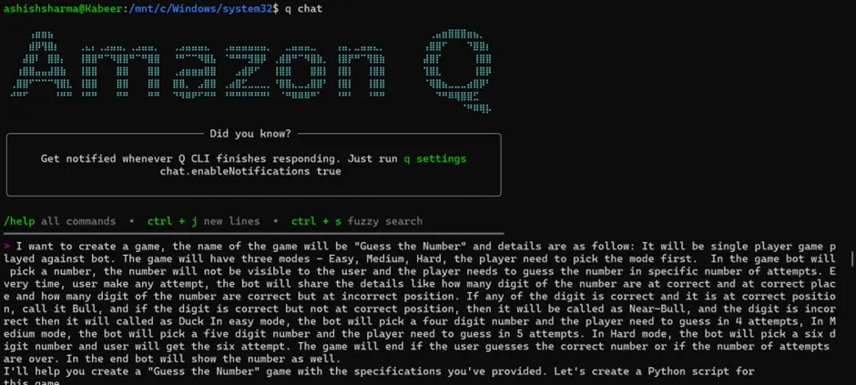

Provided Prompt (Instruction):

I want to create a game, the name of the game will be "Guess the Number" 
and details are as follow: It will be single player game played against bot. 
The game will have three modes - Easy, Medium, Hard, the player need to pick 
the mode first, then the bot will pick a number, the number should not be 
visible to the user and the player needs to guess the number in 
specific number of attempts. Every time, user make any attempt, 
the bot will share the details like how many digit of the number are at 
correct and at correct place and how many digit of the number are correct
but at incorrect position. If any of the digit is correct and it is at 
correct position, call it Bull, and if the digit is correct but not at 
correct position, then it will be called as Near-Bull, and the digit is 
incorrect then it will called as Duck In easy mode, the bot will pick a 
four digit number and the player need to guess in 4 attempts, 
In Medium mode, the bot will pick a five digit number and the player need to 
guess in 5 attempts. In Hard mode, the bot will pick a six digit number 
and user will get the six attempt. The game will end if the user guesses 
the correct number or if the number of attempts are over. In the end bot will 
show the number as well. 
After provided the prompt, the Amazon Q starts its magic and creates set of python code in few seconds.

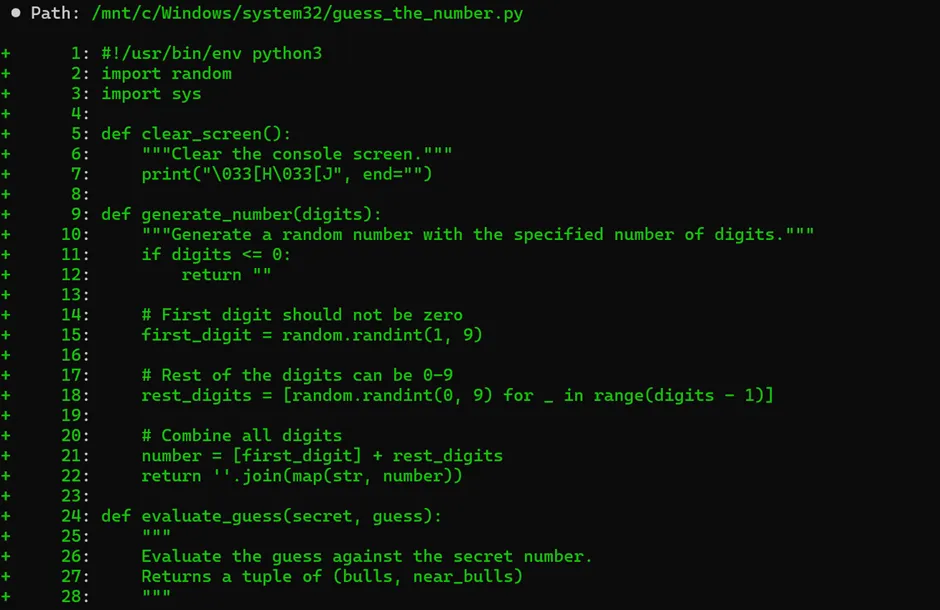

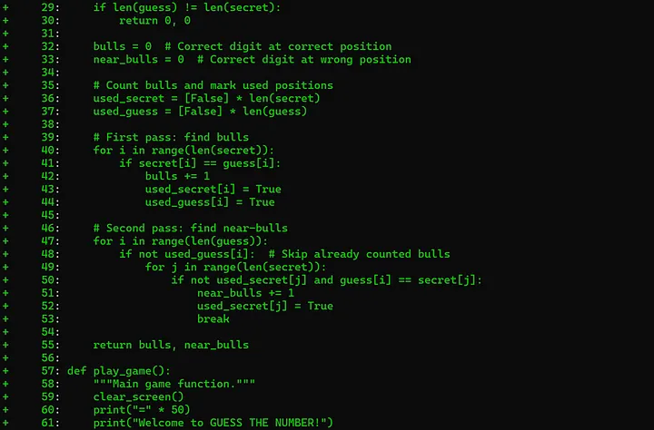

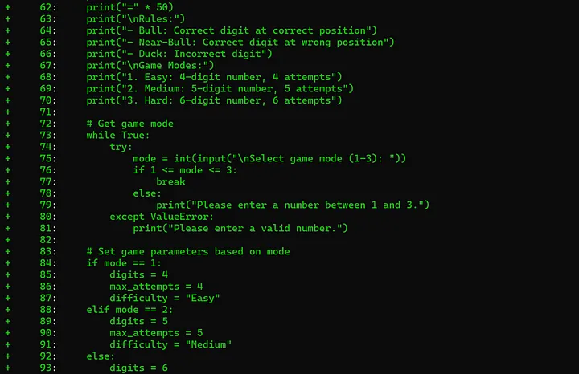

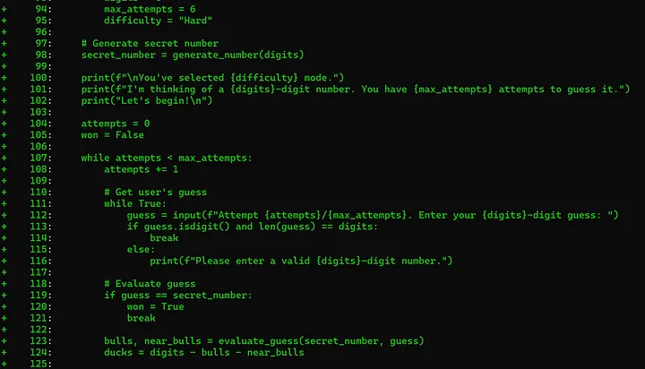

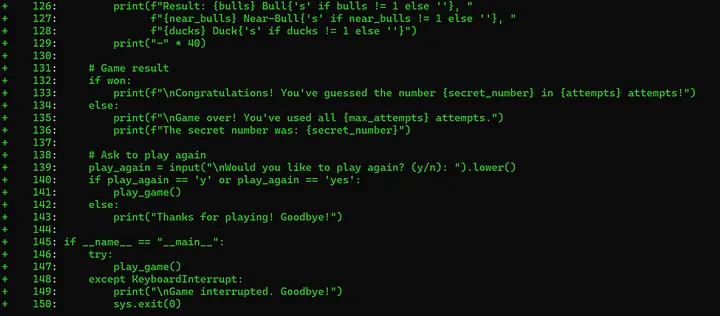

It creates the code and save the code to a new directory as well.

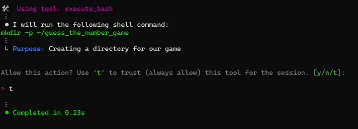

Here is the created module high level doc

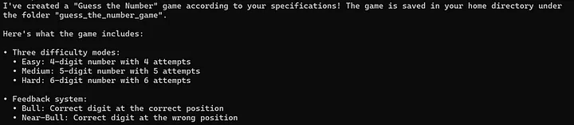

Now with all the code and program is ready to execute, lets play the game:

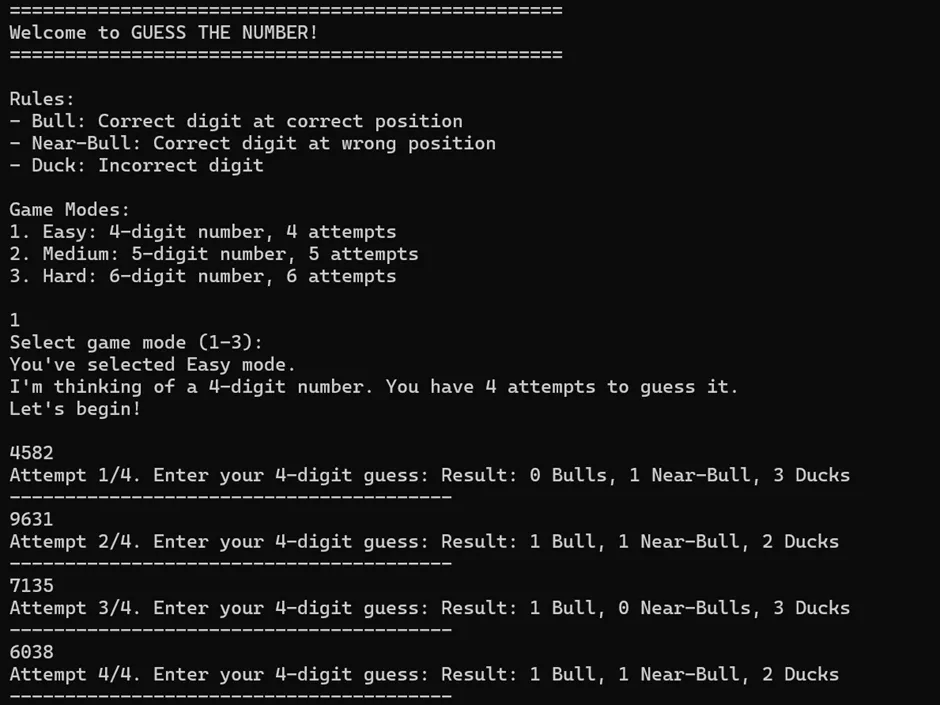

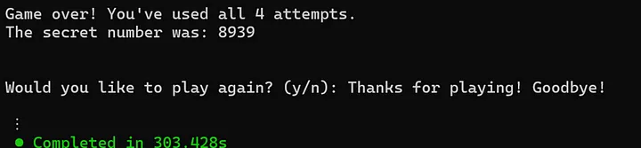

### Improvement Request:

After playing the game for the first time, I noticed an issue with the original instructions:

1. The number the bot assumes can potentially include repetitive digits.
2. This small detail affects the outcome delivered to the player.

Requested Update:
I’ve asked Amazon Q Chat to modify the existing code with one crucial change:

- The assumed number should not have any repetitive digits.

This adjustment will ensure a more consistent and fair gameplay experience.

Please refer to the provided snapshot for the exact instructions given to update the code.

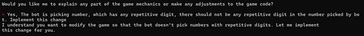

After providing the updated instruction, the Amazon Q update the existing code.

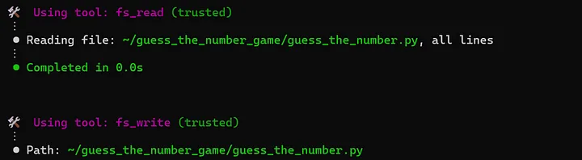

The feedback after update is as below:

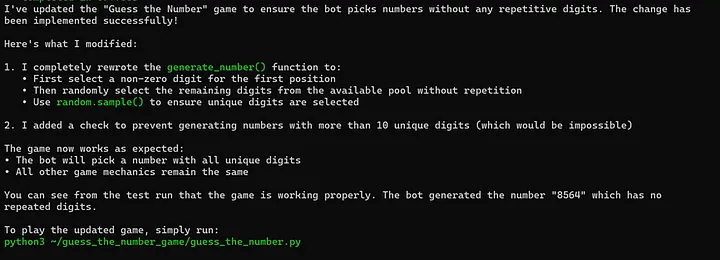

Lets play the final game:

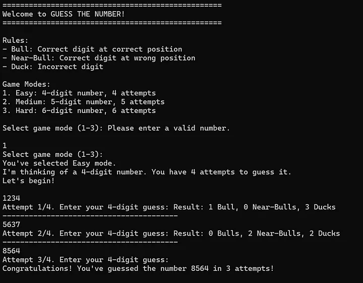

Bingo, I got the number. 🎉

Thank you for taking the time to read this blog post. While the code snippet I’ve shared here is relatively small and was generated with the help of Amazon Q, it represents just a fraction of how I utilize AI tools in my daily work.

These powerful assistants have become an integral part of my workflow, aiding me in various tasks such as:

• Writing small code snippets
• Debugging and troubleshooting
• Refining and optimizing existing code
• Tackling larger projects like application migration
• Refactoring entire codebases

The rapid evolution of AI tools is undeniable, and their impact on our industry is profound. As professionals, it’s crucial that we embrace these technologies and learn to leverage them effectively for our specific business needs.

By doing so, we can enhance our productivity, streamline our processes, and stay competitive in an ever-changing technological landscape.

I encourage you to explore how AI tools can benefit your own work and organization. The future is here, and it’s exciting to be part of this transformative era in software development and beyond.

Thank you again for your interest, and I hope this post has inspired you to dive deeper into the world of AI-assisted development!